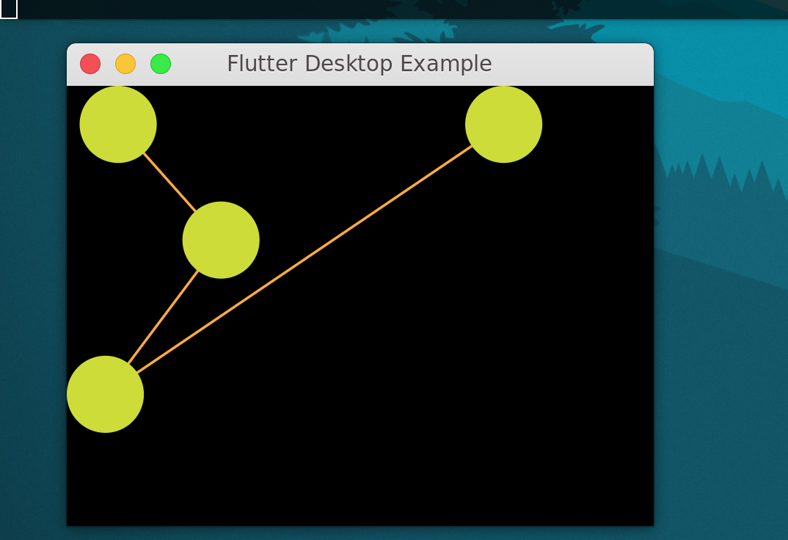

# flutter_graph

An experimental attempt to create a network graph library.

Currently in progress, basic rendering and node selection works, but still no dynamic placement/spacing or physics-based movement/scrolling implemented yet. The application is setup for linux but should work on other platforms (in theory).

